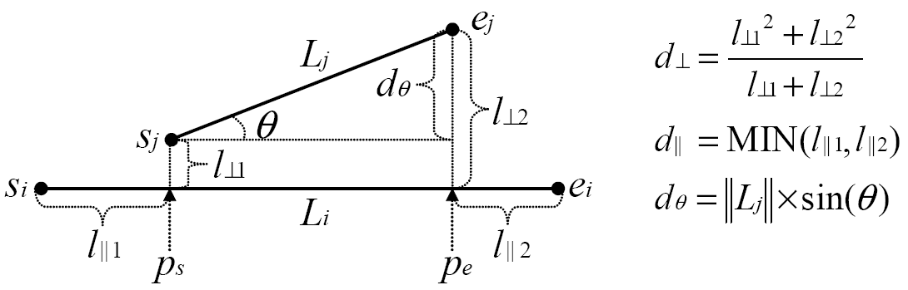

```{r setup, include = FALSE}
knitr::opts_chunk$set(
  collapse = TRUE,
  comment  = "#>",
  fig.width  = 7,
  fig.height = 5
)
library(TRACLUS)
```

<div style="background-color: #f0f7fb; border-left: 4px solid #3498db; padding: 12px 16px; margin-bottom: 20px;">
**Note:** This package was developed as part of a university course project
(*Data Analytics -- Unsupervised Learning*, TU Dresden). The vignette is
intentionally detailed and explains each step from the ground up.

This vignette walks through each phase using a small toy dataset. For a
real-world application to the NHC Atlantic hurricane database, see the
[HURDAT2 case study](#application-atlantic-hurricanes-hurdat2) at the end of
this document.
</div>

## Overview

TRACLUS (TRAjectory CLUStering) is a partition-and-group algorithm for clustering
spatial trajectories. Rather than treating each trajectory as a single object,
TRACLUS first partitions trajectories into line segments and then clusters those
segments. This allows the algorithm to discover common sub-trajectories even when
the full trajectories differ substantially.

The algorithm was introduced by Lee, Han, and Whang (2007) and consists of three
phases:

1. **Partition** each trajectory into characteristic line segments using the
   Minimum Description Length (MDL) principle
2. **Cluster** the resulting segments using a density-based approach adapted
   from DBSCAN
3. **Summarise** each cluster into a single representative trajectory via a
   sweep-line procedure

---

## The toy dataset

All examples in this vignette use a set of six hand-crafted trajectories. Five
of them (TR1 to TR5) share a common movement pattern through the middle of the
plot, all travelling roughly from left to right with a slight upward drift.
TR6 is an intentional outlier that crosses the others vertically. It is included
to demonstrate how TRACLUS separates noise from genuine clusters.
```{r toy-dataset}
trajs <- make_toy_trajectories()
plot_trajectories(trajs, "Toy dataset: six trajectories")
# trajs is a named list of matrices, one per trajectory.
# Each matrix has two columns (x, y) and one row per recorded position.
str(trajs[1])  # preview the first trajectory
```

---

## The distance function

TRACLUS measures the similarity between two line segments using a weighted sum
of three components. Given a longer segment $L_i$ and a shorter segment $L_j$,
the total distance is:

$$\text{dist}(L_i, L_j) = w_\perp \cdot d_\perp + w_\parallel \cdot d_\parallel + w_\theta \cdot d_\theta$$

The figure below (from the original paper) illustrates how the three components
relate to the geometry of two line segments. $p_s$ and $p_e$ are the projections
of $L_j$'s endpoints onto the line through $L_i$.

```{r distance-figure, echo = FALSE, out.width = "75%", fig.align = "center"}

```
<p style="text-align: center; font-size: 0.85em; color: #555;">
Source: Lee, J.-G., Han, J. and Whang, K.-Y. (2007), Figure 5.
Reproduced for educational purposes under fair use.
</p>

The three components are:

- $d_\perp$: **perpendicular distance**. Measures how far $L_j$ sits off the
  line through $L_i$. The two perpendicular distances $l_{\perp 1}$ and
  $l_{\perp 2}$ are combined via a Lehmer mean (order 2), which pulls the result
  toward the larger of the two values. This means that if one endpoint of $L_j$
  is far off the line and the other is close, the result is closer to the larger
  deviation than a plain average would give.
- $d_\parallel$: **parallel distance**. Measures how far $L_j$ extends beyond
  the endpoints of $L_i$ along $L_i$'s own axis. The minimum of the two
  projection distances is used so that a slight longitudinal overhang on one
  side does not dominate.
- $d_\theta$: **angle distance**. Equal to the length of $L_j$ scaled by
  $\sin(\theta)$, where $\theta$ is the smaller angle between the two segments.
  When the angle reaches or exceeds 90 degrees, the full length of $L_j$ is
  returned as the worst-case penalty.

These three components serve different roles in the algorithm. In the **MDL
partitioning** phase, only $d_\perp$ and $d_\theta$ are used to measure how
much each raw sub-segment deviates from a candidate partition. The parallel
distance is not needed here because a trajectory always encloses its own
partitions (Lee et al. 2007, Section 3.2). In the **clustering** phase, all
three components are combined with their weights to determine which segments are
neighbours. The **representative trajectory** phase does not use the distance
function directly; it operates on the geometric positions of the clustered
segments via a sweep-line procedure.

The entire pairwise distance computation in the clustering phase is implemented
in C++ via Rcpp. This is the most expensive step of the algorithm (quadratic in
the number of segments), and the C++ implementation avoids the overhead of
n-squared R-level function calls.

```{r distance-components}
# Individual distance components between two example segments
si <- c(0, 0);  ei <- c(10, 0)  # Li: horizontal
sj <- c(2, 3);  ej <- c(8, 5)   # Lj: offset and slightly tilted

dist_perpendicular(si, ei, sj, ej)
dist_parallel(si, ei, sj, ej)
dist_angle(si, ei, sj, ej)

# Combined distance (default weights: all 1)
dist_segments(si, ei, sj, ej, w_perp = 1, w_par = 1, w_angle = 1)
```

The weights `w_perp`, `w_par`, and `w_angle` are all 1 by default. Lee et al.
(2007) report that equal weights work well across a range of applications.
Adjusting them shifts the clustering focus:

- Increase `w_perp` to emphasise spatial proximity. Segments far apart
  perpendicular to their direction will be separated more aggressively.
- Increase `w_angle` to emphasise directional similarity. Segments pointing
  in different directions will be harder to cluster even if spatially close.
- Set a weight to 0 to ignore that component entirely.

```{r distance-weights}
# TR1-like segment: nearly horizontal
tr1_start <- c(0, 0);  tr1_end <- c(40,  4)
# TR6 segment: near-vertical outlier
tr6_start <- c(35, 35); tr6_end <- c(38, -5)

# Default: equal weights
dist_segments(tr1_start, tr1_end, tr6_start, tr6_end,
              w_perp = 1, w_par = 1, w_angle = 1)

# Direction-focused: angle component doubled
dist_segments(tr1_start, tr1_end, tr6_start, tr6_end,
              w_perp = 1, w_par = 1, w_angle = 2)

# Position only: direction ignored
dist_segments(tr1_start, tr1_end, tr6_start, tr6_end,
              w_perp = 1, w_par = 1, w_angle = 0)
```

The large angle distance between TR1 and TR6 foreshadows why TR6 will not be
assigned to any cluster in the grouping phase.

---

## Phase 1: MDL partitioning

The partitioning phase converts each trajectory into a compact set of line
segments. The MDL principle balances two competing costs:

- $L(H)$: the cost of encoding the partition itself (fewer, longer segments
  are cheaper)
- $L(D|H)$: the cost of encoding the deviation of the raw points from the
  partition (smaller deviations are cheaper). This cost is measured using
  $d_\perp$ and $d_\theta$ only, as explained in the distance function section
  above.

Imagine a trajectory that first runs straight and then makes a sharp turn. While
the greedy scan is on the straight section, a single segment covers all points
with very little deviation, so $L(D|H)$ is small and keeping one long segment is
cheaper than storing many short ones. As soon as the turn begins, the deviation
from the single-segment hypothesis grows rapidly and $L(D|H)$ spikes. At that
point, splitting becomes cheaper: the previous point is recorded as a
characteristic point and the scan restarts from there.
```{r partition}
segs <- partition_trajectories(trajs)

# segs is a data frame with one row per segment.
# Each row contains the trajectory ID, segment index, and start/end coordinates.
head(segs)

cat("Trajectories:", length(trajs), "\n")
cat("Segments:    ", nrow(segs),    "\n")
# Each trajectory is reduced to a small number of characteristic segments
cat("\nSegments per trajectory:\n")
print(table(segs$traj_id))
```
```{r partition-plot}
plot_trajectories(trajs, "MDL partitioning result")

# Mark characteristic points (segment boundaries)
starts <- segs[, c("sx", "sy")]
ends   <- segs[, c("ex", "ey")]
colnames(ends) <- c("sx", "sy")
char_points <- unique(rbind(starts, ends))
points(char_points[, 1], char_points[, 2], pch = 4, cex = 1.2, lwd = 2)
```

The X marks show where the MDL criterion detected a meaningful direction change.
TR1 through TR5 each produce two segments: one covering the straight middle
section and one for the diverging end. TR6 runs in a straight vertical line and
is collapsed into a single segment.

---

## Phase 2: Density-based clustering

The clustering phase adapts DBSCAN to line segments, using the full weighted
distance function ($d_\perp$, $d_\parallel$, $d_\theta$) to determine which
segments are neighbours. Two parameters control the result:

- `eps`: distance threshold in the same unit as the coordinates (km for
  projected data). Two segments are neighbours if their TRACLUS distance is at
  or below `eps`.
- `min_lns`: minimum neighbourhood size for a segment to qualify as a core
  segment. The same threshold is also applied as a minimum trajectory
  cardinality: clusters whose segments originate from fewer than `min_lns`
  distinct trajectories are discarded.

```{r clustering}
clustered_segs <- cluster_segments(segs,
                                   eps     = 20,
                                   min_lns = 3,
                                   w_perp  = 1,
                                   w_par   = 1,
                                   w_angle = 1)

cat("Cluster assignments:\n")
print(table(clustered_segs$cluster_id, useNA = "ifany"))
```
```{r clustering-plot}
reps_toy <- compute_all_representatives(clustered_segs,
                                        min_lns = 3,
                                        gamma   = 1)
plot_traclus_result(clustered_segs, reps_toy,
                    title = "Clustering result (eps=20, min_lns=3)")
```

Dashed grey segments are noise. Coloured segments belong to the shared cluster
covering the common middle section of TR1 through TR5. TR6 and all diverging
end segments are classified as noise because they do not share direction or
position with enough neighbours.

---

## Phase 3: Representative trajectory

For each cluster, a sweep line moves along the average direction of the cluster.
Think of a ruler placed perpendicular to the cluster's main axis, sliding from
one end to the other. At each position where the ruler crosses at least
`min_lns` segments, the average of the crossing points is recorded as a waypoint.
The sequence of these waypoints forms the representative trajectory.

Note that `min_lns` appears both in the clustering phase and here. In clustering,
it controls the minimum neighbourhood size for core segments. In the
representative trajectory phase, it controls the minimum number of simultaneously
active segments required to emit a waypoint. Lee et al. (2007) use the same
value for both because the underlying idea is the same: how many segments need
to come together before we consider a pattern genuine?

The `gamma` parameter is the minimum spacing between consecutive waypoints,
measured along the cluster's average direction axis. A smaller `gamma` allows
waypoints to be placed closer together, producing a more detailed representative
trajectory. A larger `gamma` enforces wider spacing and a smoother result.

Lee et al. (2007) do not prescribe a specific value. A sensible starting point
is a small fraction of the typical segment length in your dataset. For the toy
dataset with segments of roughly 10 to 20 km, `gamma = 1` works well.
```{r representative}
reps <- compute_all_representatives(clustered_segs,
                                    min_lns = 3,
                                    gamma   = 1)
cat("Clusters with a representative:", length(reps), "\n")

# You can also compute the representative for a single cluster directly:
single_cluster <- clustered_segs[!is.na(clustered_segs$cluster_id) &
                                   clustered_segs$cluster_id == 1, ]
rt <- compute_representative(single_cluster, min_lns = 3, gamma = 1)
head(rt)
```

The bold coloured line in the plot above summarises the shared movement pattern
of the five clustered trajectories through the middle section.

---

## Full pipeline

The `traclus()` function runs all three phases in sequence:
```{r full-pipeline}
traclus_result <- traclus(make_toy_trajectories(),
                          eps     = 20,
                          min_lns = 3,
                          w_perp  = 1,
                          w_par   = 1,
                          w_angle = 1,
                          gamma   = 1)

str(traclus_result$params)
print(table(traclus_result$segments$cluster_id, useNA = "ifany"))
cat("\nRepresentatives found:", length(traclus_result$representatives), "\n")
```

---

## Parameter selection

### Choosing `eps`

Choosing `eps` is the most important tuning step. The `estimate_eps` function
implements the entropy heuristic from Section 4.4 of Lee et al. (2007). It
evaluates a grid of candidate epsilon values and computes the entropy of the
neighbourhood-size distribution at each one.

The idea is that at a good `eps` value, the neighbourhood sizes are skewed: a
few dense regions contain many segments while most segments sit in sparse areas.
This skewness corresponds to low entropy. At a bad `eps` (too small or too
large), neighbourhood sizes tend to be uniform and entropy is high.

```{r estimate-eps}
eps_estimate <- estimate_eps(segs, sample_size = 200L)
cat("Suggested eps:", round(eps_estimate$eps_opt, 2), "\n")

plot(eps_estimate$entropy_df$eps, eps_estimate$entropy_df$entropy,
     type = "b", pch = 19, cex = 0.7,
     xlab = "eps", ylab = "Entropy",
     main = "Entropy heuristic for eps selection")
```

The entropy curve should be treated as a rough guide, not an oracle. The global
minimum is one candidate, but positions where the entropy drops sharply can be
equally informative since they indicate that structure is emerging at that scale.
In practice, the most reliable approach is to use the curve to narrow down the
search range and then try a few values by visual inspection. Simply
experimenting with different `eps` values and comparing the resulting clusters
is a perfectly legitimate strategy.

Note: on small datasets like this toy example the entropy curve is noisy because
too few segments are available to produce a meaningful neighbourhood-size
distribution. The heuristic works best with hundreds to thousands of segments.

### Choosing `min_lns`

Lee et al. (2007) recommend computing the average neighbourhood size at the
selected `eps` and setting `min_lns` to that average plus 1 to 3. The idea is
that `min_lns` should be slightly above the average density so that only
genuinely dense regions qualify as clusters.

In practice: run `estimate_eps` on your dataset, pick an `eps` from the
promising range, then try a few values of `min_lns` and compare the results by
visual inspection. For the toy dataset with only five trajectories sharing a
common pattern, `min_lns = 3` is a natural starting point.

---

## Visualisation modes

`plot_traclus_result` offers two display modes. In `"clusters"` mode (the
default), each cluster's segments share the colour of their representative
trajectory. In `"representatives"` mode, all clustered segments are drawn in a
neutral grey and only the representative trajectories carry colour.

```{r vis-modes, fig.width = 9, fig.height = 4.5}
par(mfrow = c(1, 2))
plot_traclus_result(clustered_segs, reps_toy,
                    mode = "clusters",
                    title = "Mode: clusters")
plot_traclus_result(clustered_segs, reps_toy,
                    mode = "representatives",
                    title = "Mode: representatives")
```

---

## Application: Atlantic hurricanes (HURDAT2) {#application-atlantic-hurricanes-hurdat2}

The HURDAT2 (Hurricane Database 2) best-track file published by NOAA's National
Hurricane Center contains the position, intensity, and size of all known Atlantic
tropical and subtropical cyclones at 6-hourly intervals, going back to 1851.

Following Lee et al. (2007), we use the Atlantic hurricanes from the years 1950
through 2004.

### Loading and projecting the data

`read_hurdat2()` parses the raw fixed-width text file and converts geographic
coordinates (latitude/longitude in degrees) to a Cartesian plane in kilometres.
The projection uses an equirectangular approximation centred on the dataset mean.
This is not a geodetically precise projection, but the distance error relative to
the Haversine formula stays below 2% over the Atlantic basin (roughly
10 degrees N to 60 degrees N, 20 degrees W to 100 degrees W), which is
acceptable for the relative distance comparisons that TRACLUS performs.

```{r hurdat-load}
path   <- system.file("extdata", "hurdat2-1851-2024-040425.txt",
                       package = "TRACLUS")
hurdat <- read_hurdat2(path)

# Subset to 1950-2004, matching the evaluation period in Lee et al. (2007)
storm_years <- as.integer(substr(names(hurdat), 5, 8))
hurdat_sub  <- hurdat[storm_years >= 1950 & storm_years <= 2004]

cat("Storms loaded (total):", length(hurdat), "\n")
cat("Storms in 1950-2004: ", length(hurdat_sub), "\n")
```

### Partitioning

```{r hurdat-partition}
hurdat_segs <- partition_trajectories(hurdat_sub)
cat("Line segments:", nrow(hurdat_segs), "\n")
cat("\nSegments per storm (summary):\n")
print(summary(as.integer(table(hurdat_segs$traj_id))))
```

### Parameter estimation

With thousands of segments the entropy heuristic produces a smoother curve. We
evaluate candidates between 1 and 250 km, which covers the range where cluster
structure typically begins to emerge for hurricane track data.

```{r hurdat-eps, fig.height = 4}
hurdat_est <- estimate_eps(hurdat_segs,
                           eps_grid    = seq(1, 250, length.out = 30),
                           sample_size = 500L)
cat("Entropy-minimum eps:", round(hurdat_est$eps_opt, 1), "\n")

plot(hurdat_est$entropy_df$eps, hurdat_est$entropy_df$entropy,
     type = "b", pch = 19, cex = 0.6,
     xlab = "eps (km)", ylab = "Entropy",
     main = "Entropy heuristic (HURDAT2 1950-2004)")
```

The entropy curve narrows the search range. After experimenting with values in
and around this range, `eps = 85` with `min_lns = 5` produced well-separated
clusters that correspond to recognisable hurricane movement patterns.

### Clustering and representative trajectories

```{r hurdat-cluster}
hurdat_clustered <- cluster_segments(hurdat_segs,
                                     eps     = 85,
                                     min_lns = 5,
                                     w_perp  = 1,
                                     w_par   = 1,
                                     w_angle = 1)

n_cl <- length(unique(hurdat_clustered$cluster_id[
  !is.na(hurdat_clustered$cluster_id)]))
n_ns <- sum(is.na(hurdat_clustered$cluster_id))
cat("Clusters:", n_cl, "\n")
cat("Noise segments:", n_ns, "of", nrow(hurdat_clustered), "\n")
```

```{r hurdat-representatives}
hurdat_reps <- compute_all_representatives(hurdat_clustered,
                                           min_lns = 5,
                                           gamma   = 200)
cat("Representative trajectories:", length(hurdat_reps), "\n")
```

### Visualisation

```{r hurdat-plot-clusters, fig.width = 9, fig.height = 6}
plot_traclus_result(hurdat_clustered, hurdat_reps,
                    mode    = "clusters",
                    title   = "Atlantic hurricanes 1950-2004 (cluster view)",
                    seg_lwd = 0.8, noise_lwd = 0.3)
```

```{r hurdat-plot-reps, fig.width = 9, fig.height = 6}
plot_traclus_result(hurdat_clustered, hurdat_reps,
                    mode    = "representatives",
                    title   = "Atlantic hurricanes 1950-2004 (representative view)",
                    seg_lwd = 0.5, noise_lwd = 0.3)
```

```{r hurdat-leaflet, fig.height = 6, eval = requireNamespace("leaflet", quietly = TRUE) && requireNamespace("sf", quietly = TRUE)}
library(leaflet)
library(sf)

# Retrieve the projection origin (in radians) used by .project_to_cartesian
lat_ref <- attr(hurdat, "lat_ref")
lon_ref <- attr(hurdat, "lon_ref")

# Back-project km coordinates to geographic lat/lon (inverse of the equirectangular projection)
km_to_lat <- function(y) (lat_ref + y / 6371.0) * 180 / pi
km_to_lon <- function(x) (lon_ref + x / (6371.0 * cos(lat_ref))) * 180 / pi

# Helper: convert segment rows to a single MULTILINESTRING sf object
segs_to_sf <- function(segs) {
  lines <- lapply(seq_len(nrow(segs)), function(i) {
    st_linestring(matrix(c(
      km_to_lon(c(segs$sx[i], segs$ex[i])),
      km_to_lat(c(segs$sy[i], segs$ey[i]))
    ), ncol = 2))
  })
  st_sfc(lines, crs = 4326)
}

pal <- c("#E69F00", "#56B4E9", "#009E73", "#F0E442",
         "#0072B2", "#D55E00", "#CC79A7", "#000000")
cluster_ids <- sort(unique(hurdat_clustered$cluster_id[
  !is.na(hurdat_clustered$cluster_id)]))

m <- leaflet() |> addProviderTiles(providers$CartoDB.Positron)

# Noise segments in grey, dashed
noise_h <- hurdat_clustered[is.na(hurdat_clustered$cluster_id), ]
if (nrow(noise_h) > 0L) {
  m <- m |> addPolylines(data = segs_to_sf(noise_h),
                         color = "#999999", weight = 0.5, opacity = 0.4,
                         dashArray = "4 4")
}

# One layer per cluster (single addPolylines call each)
for (k in seq_along(cluster_ids)) {
  cid   <- cluster_ids[k]
  csub  <- hurdat_clustered[!is.na(hurdat_clustered$cluster_id) &
                              hurdat_clustered$cluster_id == cid, ]
  col_k <- pal[(k - 1L) %% length(pal) + 1L]
  m <- m |> addPolylines(data = segs_to_sf(csub),
                         color = col_k, weight = 1, opacity = 0.6)
}

# Representative trajectories as single polylines with black outline
for (k in seq_along(hurdat_reps)) {
  rt    <- hurdat_reps[[k]]
  col_k <- pal[(k - 1L) %% length(pal) + 1L]
  coords <- matrix(c(km_to_lon(rt[, "x"]), km_to_lat(rt[, "y"])), ncol = 2)
  line_sf <- st_sfc(st_linestring(coords), crs = 4326)
  # Black outline first, then coloured line on top
  m <- m |> addPolylines(data = line_sf,
                         color = "black", weight = 7, opacity = 1)
  m <- m |> addPolylines(data = line_sf,
                         color = col_k, weight = 5, opacity = 1,
                         popup = paste("Cluster", names(hurdat_reps)[k]))
}

# Legend matching cluster colours
m <- m |> addLegend(
  position = "bottomright",
  colors   = c("#999999", pal[seq_along(hurdat_reps)]),
  labels   = c("Noise", paste("Cluster", names(hurdat_reps))),
  title    = "Clusters",
  opacity  = 1
)

m
```

### Interpretation

Each representative trajectory (bold coloured line) summarises a common
hurricane movement pattern. Typical patterns in the Atlantic basin include
east-to-west tracks through the Caribbean, recurving tracks that turn northward
along the U.S. East Coast, and straight westward tracks at low latitudes. The
noise segments (grey, dashed) correspond to storm track portions that do not
share direction or position with enough other storms to form a cluster.

The exact number and shape of clusters depends on `eps` and `min_lns`. A smaller
`eps` produces more, tighter clusters; a larger `eps` merges nearby patterns into
broader clusters. The entropy heuristic provides a starting range, but trying a
few values and comparing the results visually is the most reliable approach.

---

## References

Lee, J.-G., Han, J., and Whang, K.-Y. (2007). Trajectory clustering: a
partition-and-group framework. *Proceedings of the 2007 ACM SIGMOD International
Conference on Management of Data*, 593-604.
https://doi.org/10.1145/1247480.1247546

National Hurricane Center (2025). Atlantic hurricane database (HURDAT2).
National Oceanic and Atmospheric Administration.
https://www.nhc.noaa.gov/data/
